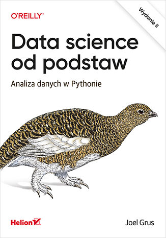
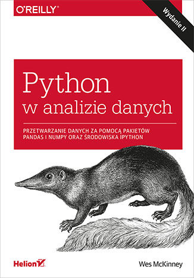

# Szkolenie z analizy danych w Python [9-12.12.24]

Linkedin: https://www.linkedin.com/in/tomasz-wilinski/

email: tomasz.wilinski97@gmail.com

--------------------------------------------------------------------------------------

## NUMPY

o module numpy.linalg: https://numpy.org/doc/stable/reference/routines.linalg.html

o module numpy.random: https://numpy.org/doc/stable/reference/random/legacy.html

### Losowanie 6 liczb z przedziału [1, 49] bez powtórzeń

```python
numbers = np.random.choice(np.arange(1, 50), size=6, replace=False)
print(numbers)
```

--------------------------------------------------------------------------------------
## Środowiska wirtualne (Windows):

### Anaconda (conda)

1. Graficznie - przez GIU - Anaconda Navigator (Environments -> Create) a potem zaintalowanie Jupiter Notebook w zakładce Home (dla wybranego środowiska)

2. Przez terminal Anaconda Prompt:

    1. conda create --name `nazwa_środowiska` python=3.12.7
    2. conda activate `nazwa_środowiska`
    3. pip install notebook ipykernel
    4. python -m ipykernel install --user --name=`nazwa_środowiska` --display-name "Conda (`nazwa_środowiska`)"
    5. jupyter notebook

### Python VENV:

komendy do sprawdzania wersji pythona:
- python –-version
- py -0

*OPCJONALNIE* : - zmiana zmiennych środowiskowych (environmental variables) - jeśli jest wymagana

Tworzenie środowiska wirtualnego:

1. py -3.13 -m venv `nazwa_środowiska`
2. `nazwa_środowiska`\Scripts\activate **LUB** source `nazwa_środowiska`/bin/activate  # dla systemów Unix
3. pip install notebook ipykernel
4. python -m ipykernel install --user --name=`nazwa_środowiska` --display-name "Python (`nazwa_środowiska`)"
5. jupyter notebook

*OPCJONALNIE* : usunięcie środowiska:

1. rmdir /s /q `nazwa_środowiska`

*OPCJONALNIE* : usunięcie kertnera Jupiter:

1. usunięcie ręczne folderu z nazwą kernela w Jupiter w odpowiedniej ścieżce: C:\Users\labuser\AppData\Roaming\jupyter\kernels

--------------------------------------------------------------------------------------

## PANDAS

### Zarządzanie brakami danych przy wczytywaniu pandas.DataFrame()

```python
import pandas as pd

df = pd.read_csv(
    "plik.csv",
    na_values=["NA", "Brak", "-", "None", " "]  # Wartości traktowane jako brakujące
)

print(df)
```
wartości brakujące (określone przez `na_values`) zostaną zamienione na `numpy.nan`

### SQL w pandas

- PandasQL (pandasql)

### Łącznie się z istniejącą bazą danych:

1. **PostgreSQL** -> psycopg2
2. **Oracle** -> cx_Oracle
3. **MySQL** -> pymysql
4. **Microsoft SQL Server** -> pyodbc

--------------------------------------------------------------------------------------

## Polecane książki :)


- Data science od podstaw. Analiza danych w Pythonie. Wydanie II



- Python w analizie danych. Przetwarzanie danych za pomocą pakietów Pandas i NumPy oraz środowiska IPython. Wydanie II



- Statystyka praktyczna w data science. 50 kluczowych zagadnień w językach R i Python. Wydanie II


